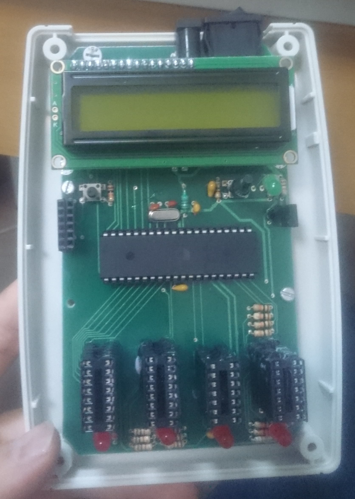
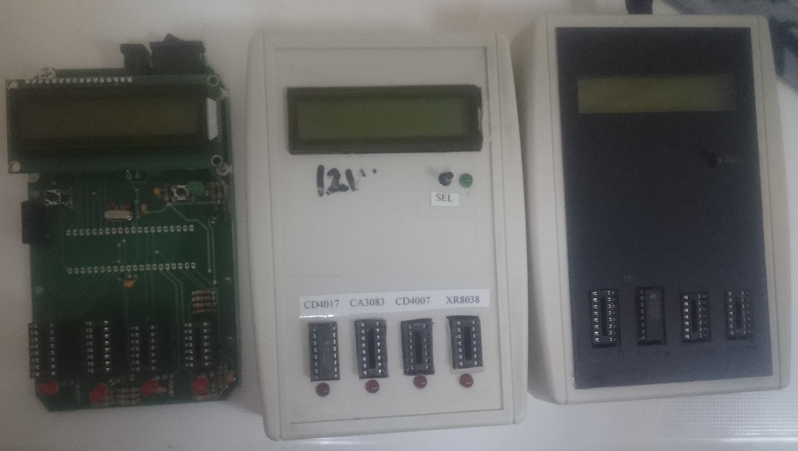

# Lab IC tester device
## A project for Electronics Labratory 
### Project Team Members:
- Masoud Babaabasi
- Ahmad Hamzeei
- Milad Katiraei
### About this project
In the Electrnics Lab, we used some known chip for our projects in the semister. Often this chips got damaged due to wrong usage and it was hard to identify the bad ones. So we got to work and made a device to test the chips autumatically.

**Chips to be testes:**
- CD4017
- XR8038
- CA3083
- CD4007

The device has 4 slots for the chips, One select button and a 2*16 characher LCD display. The device centeral controller is a Atmega16.

